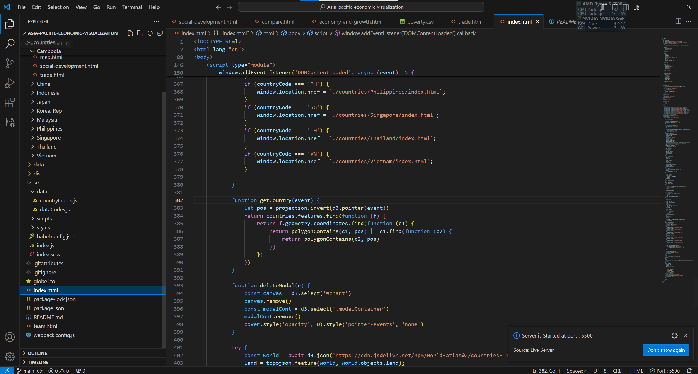
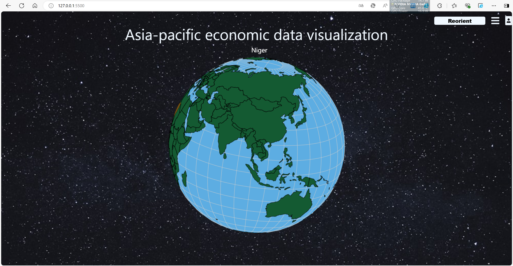
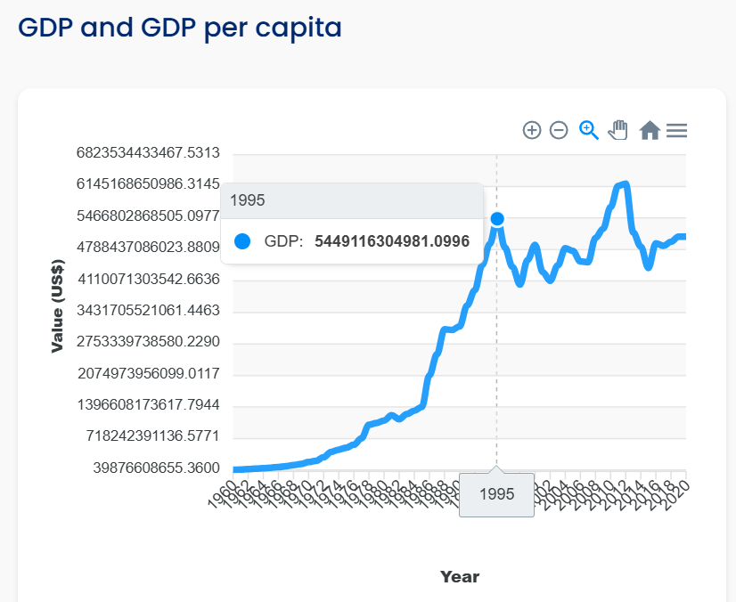
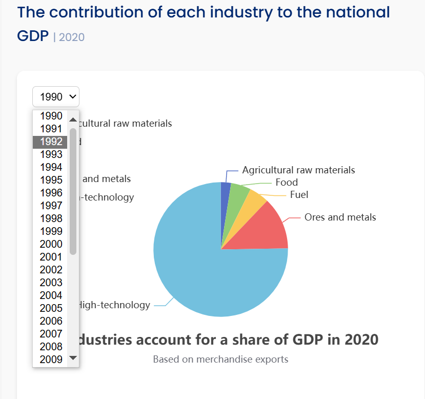
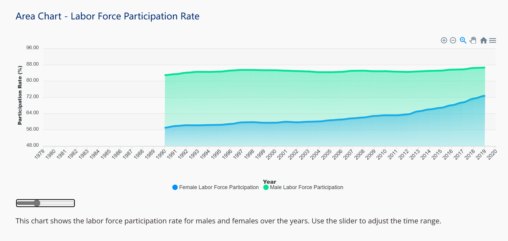

# Asia-pacific economic visualization
---
---

Asia-pacific economic visualization
---
---

This project is an interactive examination of the Asia-Pacific region's economy. This project contains a 3D rendering of the globe, where users can navigate around our planet and investigate the economic trends of different countries in the Asia-Pacific region. By selecting a country, a graph will appear showing the economic data over the time frame available.
---
---
## 如何运行该项目：

### 方法一

首先我们需要使用vscode中的liveserver为代码创建服务器

### 方法二

在项目根目录使用命令

python -m http.server 5500

### 使用该项目
之后使用浏览器访问端口127.0.0.1:5500，
我们就可以看到可视化项目的运行主界面如下

在地球上点击你想要查看的国家就可以跳转到相应的页面

点击reorient按钮可以重新定位地球，右边菜单栏可以呼出，以查找一些领土面积过小的国家或地区，如新加坡和香港。

最右侧头像按钮可以查看小组成员信息。

以日本为范例介绍可视化界面的操作

将鼠标悬停在图表上可以查看其详细信息

年份选择按钮可以选择想查看的年份

图表中下面的拖动条改变时间选择范围